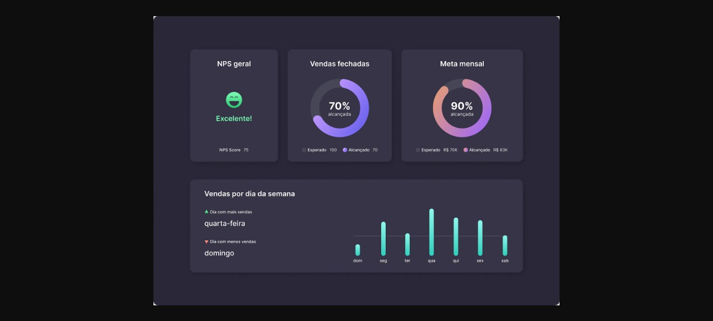

<h1 align="center"> Dashboard </h1>

Desenvolvimento de uma Dashboard.

  

 

  

## 🚀 Tecnologias

Esse projeto foi desenvolvido com as seguintes tecnologias:

- HTML e CSS
- Git e Github
- Figma

## 🔖 Layout

Você pode visualizar o layout do projeto através [DESSE LINK](https://www.figma.com/community/file/1210217615683203825). É necessário ter conta no [Figma](https://figma.com) para acessá-lo.

---

## 📝 License

Esse projeto está sob a licença MIT.

---

Feito por Ciro Batista da Silva
